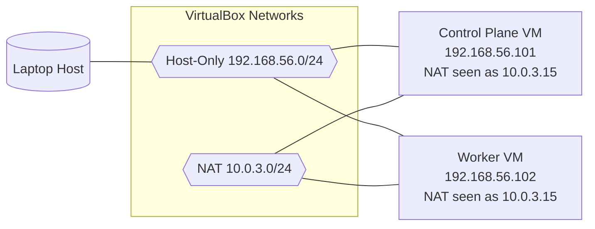
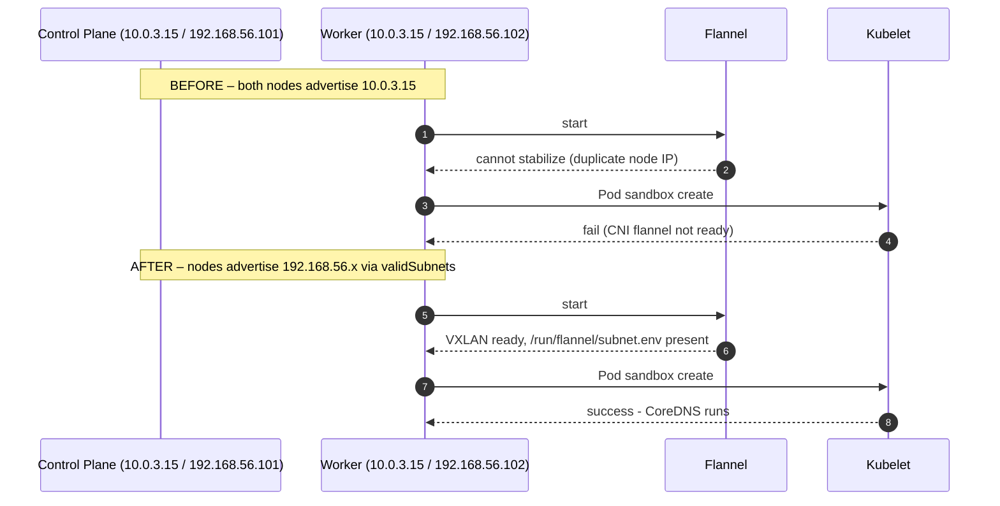
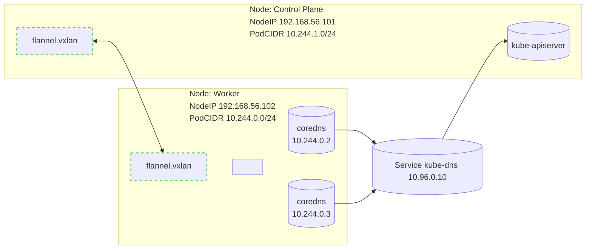

I was working on a lab and experimenting with the Talos Linux setup when I encountered an error related to Flannel as the Container Network Interface (CNI). Flannel is a straightforward overlay network provider for Kubernetes that establishes a flat, Layer 3 network for pods, enabling communication across different nodes. It assigns each node a unique subnet and uses encapsulation methods like UDP or VXLAN to route traffic between nodes, offering a basic yet easy-to-configure networking solution.

I recently spun up a local Kubernetes lab on my laptop to learn Talos Linux. The setup was straightforward:

* **Platform**: VirtualBox on Windows
    
* **Cluster**: 2 VMs
    
    * Control Plane: `talos-jk6-lje`
        
    * Worker: `talos-m9z-pjn`
        
* **OS**: Talos Linux v1.6.2
    
* **Kubernetes**: v1.29.0
    
* **CNI**: Flannel (ghcr.io/siderolabs/flannel:v0.23.0)
    

Each VM has two network adapters:

1. **NAT** (for internet access)
    
2. **Host-Only** (`192.168.56.0/24`, for cluster communication)
    

After bootstrapping the cluster, I ran `kubectl get pods -A` expecting everything to be green. Instead:

## The Problem

**What I saw:**

* CoreDNS pods stuck in `ContainerCreating`
    
    * Error: `failed to find plugin "flannel" in path [/opt/cni/bin]`
        
* `kube-flannel` DaemonSet on the worker: `CrashLoopBackOff`
    
    * Error: `loadFlannelSubnetEnv failed: open /run/flannel/subnet.env: no such file or directory`
        
* Running `kubectl get nodes -o wide` showed both nodes with the **same InternalIP**: `10.0.3.15`
    

Something was clearly wrong with the network layer.

---

## Understanding the Issue (With a Simple Analogy)

Before diving into the technical fix, let me explain what was happening using a simple analogy that even my cousin could understand.

Imagine a town where two different houses accidentally put up the **exact same street address**.

* **The Nodes are Houses**: You have a "Control Plane House" and a "Worker House".
    
* **The IP Address is the Street Address**: Both houses claim to be at "10.0.3.15".
    
* **The Network is the Mail Carrier**: When the mail carrier (Kubernetes/Flannel) tries to deliver a package, they see the address "10.0.3.15" and get confused. "I just passed this address! Which house is the real one?"
    
* **Flannel is the Road System**: Flannel tries to build a map of the town. Because of the duplicate addresses, it can't figure out which road leads where. It gives up, and the roads remain unfinished.
    
* **CoreDNS is the Phonebook**: The town's phonebook lives in one of the houses. Since the roads (Flannel) are broken, nobody can reach the house to get the phonebook. As a result, nobody can look up any numbers.
    

The fix is simple: Tell the town planner (Talos) to ignore the duplicate address and use the *other* unique address (the Host-Only network) for each house.

---

## Glossary of Terms

Before we go further, here are a few technical terms we'll use:

* **CNI (Container Network Interface)**: The plugin that lets Kubernetes pods talk to each other. We are using **Flannel**.
    
* **VXLAN**: A network technology that creates a "virtual tunnel" between nodes so pods can communicate across the cluster.
    
* **CIDR**: A way to describe a range of IP addresses (e.g., `192.168.56.0/24`).
    
* **DaemonSet**: A type of Kubernetes workload that ensures a copy of a pod runs on *every* node (like the Flannel network agent).
    

---

## My Lab's Network Architecture

Here's how I configured the network for each VM:

1. **NAT Network (**`10.0.3.0/24`): Used for internet access. VirtualBox often assigns the same IP (`10.0.3.15`) to VMs in this mode from the guest's perspective.
    
2. **Host-Only Network (**`192.168.56.0/24`): Used for communication between the Host and VMs. These IPs are unique (`.101` and `.102`).
    

### Network Topology



### Network Plan Details

* **Host-Only network** (`vboxnet0`): `192.168.56.0/24`
    
    * Control plane: `192.168.56.101`
        
    * Worker: `192.168.56.102`
        
* **NAT network**: both VMs surfaced the same internal address `10.0.3.15` to kubelet
    
* **Pod CIDRs** (flannel):
    
    * Control plane: `10.244.1.0/24`
        
    * Worker: `10.244.0.0/24`
        

### IP Summary

| Component | Address/Range | Notes |
| --- | --- | --- |
| Control Plane NodeIP | 192.168.56.101 | Host-Only adapter (preferred by kubelet) |
| Worker NodeIP | 192.168.56.102 | Host-Only adapter (preferred by kubelet) |
| NAT (both VMs) | 10.0.3.15 | Undesired for cluster traffic |
| Service CIDR | 10.96.0.0/12 (typical) | kube-dns at 10.96.0.10 |
| PodCIDR (CP) | 10.244.1.0/24 | flannel allocation |
| PodCIDR (Worker) | 10.244.0.0/24 | flannel allocation |

### Why NAT + Host-Only is Tricky

In many VirtualBox lab setups, the NAT adapter presents an identical outward address from the guest's perspective (here, `10.0.3.15`). Kubernetes picks a node IP from available interfaces. If it picks the NAT address on both nodes, flannel sees duplicate node IPs and fails to initialize the overlay.

You have two options:

1. **Remove the NAT adapter** for cluster traffic entirely
    
2. **Keep NAT only for outbound internet** and explicitly tell kubelet to use the Host-Only network (my approach)
    

Recommended for labs:

* Keep Host-Only for all cluster traffic (stable, unique IPs)
    
* Keep NAT only for VM outbound internet, but prevent Kubernetes from using it by pinning node IP selection
    

---

## Root Cause Analysis

After digging through events and logs, I realized what was happening:

Kubernetes (specifically the Kubelet) auto-detects the node's IP address from available interfaces. In my case, it was picking the NAT interface on both VMs, which presented the same address (`10.0.3.15`) from the guest OS perspective.

Flannel (the CNI plugin) uses this node IP to create the overlay network (VXLAN). When it saw duplicate IPs, it couldn't establish proper routes and failed to initialize on the worker node.

### How I Diagnosed It

Here are the exact commands ( on windows ) I ran to confirm the issue:

```powershell
# Point kubectl to the cluster
$kc = "c:\Users\Pushpendra\Desktop\projects\talos_linux_learning\kubeconfig"

# Check API and nodes
kubectl --kubeconfig $kc cluster-info
kubectl --kubeconfig $kc get nodes -o wide

# See what's failing
kubectl --kubeconfig $kc get pods -A -o wide
kubectl --kubeconfig $kc -n kube-system get ds -o wide

# Inspect the problem pods
kubectl --kubeconfig $kc -n kube-system describe pod kube-flannel-k5sdw
kubectl --kubeconfig $kc -n kube-system describe pods -l k8s-app=kube-dns
kubectl --kubeconfig $kc get events -A --sort-by=.lastTimestamp

# Confirm duplicate node IPs (this was the smoking gun!)
kubectl --kubeconfig $kc get nodes -o jsonpath="{range .items[*]}{.metadata.name}: {.status.addresses[*].type}:{.status.addresses[*].address}{'\n'}{end}"
```

**Expected telltales:**

* Duplicate `InternalIP` on two nodes
    
* kubelet events referencing flannel plugin install and missing `/run/flannel/subnet.env`
    
* CoreDNS stuck with "failed to create pod sandbox" errors
    

---



---

## The Fix

Once I understood the problem, the solution was clear: tell Talos to explicitly use the **Host-Only subnet** (`192.168.56.0/24`) and ignore the NAT IP.

Here's what I did:

### Step 1: Update Machine Configs

I edited both `_out/controlplane.yaml` and `_out/worker.yaml` to add this `kubelet` configuration:

```yaml
machine:
  kubelet:
    nodeIP:
      validSubnets:
        - 192.168.56.0/24  # Allow IPs from the Host-Only network
        - '!10.0.3.15/32'  # Explicitly deny the duplicate NAT IP
```

### Step 2: Apply the Configs

I applied the updated configs using `talosctl`, which restarted the Kubelet with the new IP selection logic:

```powershell
# Set talosconfig path
$env:TALOSCONFIG = "_out\talosconfig"

# Apply to Control Plane
talosctl -n 192.168.56.101 apply-config --mode=auto -f _out\controlplane.yaml

# Apply to Worker
talosctl -n 192.168.56.102 apply-config --mode=auto -f _out\worker.yaml

# Optional: reboot nodes for faster pickup
talosctl -n 192.168.56.101 reboot
talosctl -n 192.168.56.102 reboot
```

---

## The Result

After applying the configs and waiting a few minutes:

1. **Unique IPs**: Both nodes now advertised their Host-Only addresses (`192.168.56.101` and `192.168.56.102`)
    
2. **Flannel came alive**: The DaemonSet rolled out successfully on both nodes
    
3. **CoreDNS started**: Pods transitioned from `ContainerCreating` to `Running`
    

Success! 🎉

### Validating the Fix

I ran these commands to confirm everything was healthy:

```powershell
$kc = "c:\Users\Pushpendra\Desktop\projects\talos_linux_learning\kubeconfig"

# Nodes should now have unique InternalIP in 192.168.56.x
kubectl --kubeconfig $kc get nodes -o wide

# Flannel should be Ready everywhere
kubectl --kubeconfig $kc -n kube-system rollout status ds/kube-flannel --timeout=180s

# CoreDNS should converge to Ready
kubectl --kubeconfig $kc -n kube-system rollout status deploy/coredns --timeout=180s
kubectl --kubeconfig $kc -n kube-system get pods -o wide
```

---



---

## Verification

To make sure everything was really working, I ran a quick DNS smoke test:

```powershell
$kc = "kubeconfig"

# Create a PodSecurity-friendly test pod
@'
apiVersion: v1
kind: Pod
metadata:
  name: dns-smoke
spec:
  securityContext:
    seccompProfile:
      type: RuntimeDefault
  containers:
  - name: bb
    image: busybox:1.36
    command: ["sh","-c","sleep 3600"]
    securityContext:
      allowPrivilegeEscalation: false
      capabilities:
        drop: ["ALL"]
      runAsNonRoot: true
      runAsUser: 1000
'@ | kubectl --kubeconfig $kc apply -f -

# Wait for ready
kubectl --kubeconfig $kc wait --for=condition=Ready pod/dns-smoke --timeout=60s

# Test DNS
kubectl --kubeconfig $kc exec dns-smoke -- nslookup kubernetes.default.svc.cluster.local

# Cleanup
kubectl --kubeconfig $kc delete pod dns-smoke
```

The lookup returned `10.96.0.10` (the kube-dns service). Perfect! My cluster networking was fully operational.

**What this proves:**

1. **Pod-to-Service Communication**: The busybox pod could reach the CoreDNS service IP.
    
2. **CNI Overlay Health**: For the packet to travel from the pod to the service, the Flannel VXLAN tunnel had to be working correctly.
    
3. **DNS Resolution**: CoreDNS was actually running and able to answer the query.
    

---

## Optional Hardening

If flannel ever chooses the wrong NIC in the future, you can pin the interface explicitly in the ConfigMap.

**Why do this?** Even with the Talos fix, there's a small chance that if you add more network cards or change the VM config, the interface order could change. Pinning the interface name (e.g., `eth1`) in the Flannel config is an extra safety measure to ensure it *always* uses the correct road, no matter what.

```powershell
$kc = "c:\Users\Pushpendra\Desktop\projects\talos_linux_learning\kubeconfig"

# Export the flannel ConfigMap
kubectl --kubeconfig $kc -n kube-system get cm kube-flannel-cfg -o yaml > flannel-cm.yaml

# Edit net-conf.json in the ConfigMap and add: "Iface": "<your-host-only-iface>"
# For example: "Iface": "eth1" (or whatever interface has 192.168.56.x)

# Apply the updated ConfigMap
kubectl --kubeconfig $kc -n kube-system apply -f flannel-cm.yaml

# Restart flannel DaemonSet to pick up changes
kubectl --kubeconfig $kc -n kube-system rollout restart ds/kube-flannel
```

---

## Key Takeaways

Here's what I learned from this debugging adventure:

* **Unique node IPs are table stakes** for CNI overlays like Flannel—duplicate IPs break VXLAN tunnel establishment
    
* **VirtualBox NAT can be tricky** in multi-VM labs—it often presents the same IP (`10.0.3.15`) to multiple guests from the guest OS perspective
    
* **Talos makes it easy** to pin node IP selection with `machine.kubelet.nodeIP.validSubnets`—no need to manually configure networking
    
* **Always check events** (`kubectl get events -A --sort-by=.lastTimestamp`) when pods fail to start—they contain the real root cause
    
* **kubectl describe is your friend**—pod events show CNI failures, sandbox creation errors, and flannel state
    
* For labs: use **Host-Only for cluster traffic** (stable, predictable) and **NAT only for internet access** (avoid it for node IPs)
    
* The `validSubnets` approach lets you keep both NICs while controlling which one Kubernetes uses
    

---

## Reusable Debugging Runbook

If you hit similar issues, here's the checklist I followed:

1. **Check node IPs**: Run `kubectl get nodes -o wide`. Are the `INTERNAL-IP`s unique?
    
2. **Inspect failing pods**: Run `kubectl get pods -A -o wide`. Look for `CrashLoopBackOff` or `ContainerCreating`.
    
3. **Read events**: Run `kubectl get events -A --sort-by=.lastTimestamp`. This is often where the "smoking gun" error lives.
    
4. **Describe problematic pods**: Run `kubectl -n kube-system describe pod <pod-name>`. Look at the "Events" section at the bottom.
    
5. **Check CNI logs**: Run `kubectl -n kube-system logs <flannel-pod>`. Look for errors about "subnets" or "interfaces".
    
6. **Fix node IP selection**: Update `machine.kubelet.nodeIP.validSubnets` in your Talos config.
    
7. **Apply and Validate**: Use `talosctl apply-config`, then watch the rollout with `kubectl rollout status`.
    
8. **Smoke-test**: Run a simple pod to verify DNS and network connectivity.
    

---

## Resources

* [Talos Documentation](https://www.talos.dev/)
    
* [Flannel CNI](https://github.com/flannel-io/flannel)
    
* [Kubernetes Node IP Selection](https://kubernetes.io/docs/reference/command-line-tools-reference/kubelet/)
    
* [VirtualBox Networking Modes](https://www.virtualbox.org/manual/ch06.html)
    

---

## About This Post

This guide documents a real troubleshooting session from my Talos Linux learning journey. If you found it helpful, feel free to share it.

Happy clustering! 🚀

*Have you encountered similar networking gremlins in your home lab? Let me know in the comments.*