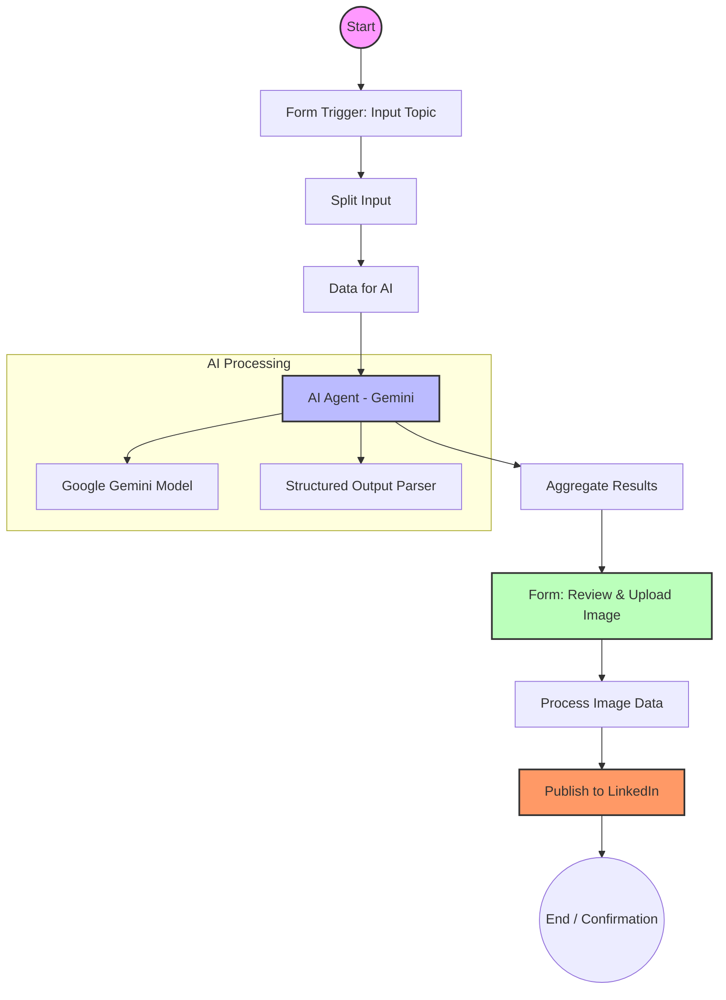

In the fast-paced world of social media, consistency is key. But for busy professionals and tech enthusiasts, maintaining a steady stream of high-quality LinkedIn posts can be a challenge.

In this post, I'll walk you through how I automated my LinkedIn content creation using **n8n**, **Google Gemini**, and a **human-in-the-loop** workflow. This system allows me to generate engaging, platform-specific content from a simple topic, review it, add visual assets, and publish it—all without leaving the automation flow.

## The Workflow Overview

The core of this automation is an **n8n** workflow that acts as my social media assistant. Here’s the high-level logic:

1. **Idea Injection**: I provide a simple "Topic" or "Title" via a web form.
    
2. **AI Processing**: An AI Agent (powered by Google Gemini) researches the topic and drafts a professional LinkedIn post, complete with hashtags and a call-to-action.
    
3. **Human Review**: The workflow pauses and presents the generated text to me. I can review it and uploading a relevant image.
    
4. **Publishing**: Once approved, the workflow automatically posts the text and image to my LinkedIn profile.
    

## The Automation Architecture

Here is the visual representation of the flow:


### The n8n Canvas View

Here's what the actual workflow looks like in n8n:


The workflow is organized into 4 distinct sections (marked by sticky notes):

1. **Get the Data for Social Media Post using the Web Form** (Yellow)
    
2. **AI Agent will do its Job** (Blue)
    
3. **Get Image to Be Published** (Light Blue)
    
4. **Publish on Social Media** (Yellow) → **Confirmation** (Green)
    

---

## Step-by-Step Node-by-Node Implementation Guide

Now, let me walk you through building this workflow from scratch. Each subsection represents a node you need to add to your n8n canvas.

### Section 1: Get the Data for Social Media Post

#### Node 1: **On form submission** (Form Trigger)

* **Node Type**: `Form Trigger`
    
* **Purpose**: This is the entry point of your workflow. It creates a web form to capture the post topic.
    
* **Configuration**:
    
    * **Form Title**: "Social Media Content AI Agent"
        
    * **Form Description**: Add a helpful description explaining what the form does
        
    * **Form Fields**:
        
        * Field Name: `Post Title/Topic`
            
        * Field Type: `Text`
            
        * Placeholder: "Write a brief and clear title or main topic for the post"
            
    * **Authentication**: Basic Auth (optional, for security)
        
    * **Button Label**: "Continue to Image Upload"
        
* **What happens**: When submitted, this triggers the workflow and passes the topic to the next node.
    

#### Node 2: **Split Form Input** (Set Node)

* **Node Type**: `Set` (Edit Fields)
    
* **Purpose**: Extract and structure the data from the form submission.
    
* **Configuration**:
    
    * **Mode**: Keep only specific fields
        
    * **Fields to Include**: `output.platform_posts.LinkedIn.post`
        
* **Connect to**: Output from `On form submission`
    

#### Node 3: **Split Data** (Set Node)

* **Node Type**: `Set` (Edit Fields)
    
* **Purpose**: Further refine the data structure.
    
* **Configuration**: Same as Split Form Input
    
* **Connect to**: Output from `Split Form Input`
    

#### Node 4: **Data for AI** (Set Node)

* **Node Type**: `Set` (Edit Fields)
    
* **Purpose**: Prepare the final input data for the AI Agent.
    
* **Configuration**:
    
    * **Assignments**:
        
        * `Post Title/Topic` = `{{ $('On form submission').item.json['Post Title/Topic'] }}`
            
        * `formMode` = `{{ $('On form submission').item.json.formMode }}`
            
* **Connect to**: Output from `Split Data`
    

---

### Section 2: AI Agent Will Do Its Job

#### Node 5: **AI Agent** (AI Agent Node)

* **Node Type**: `@n8n/n8n-nodes-langchain.agent`
    
* **Purpose**: The brain of the operation. Generates platform-specific content.
    
* **Configuration**:
    
    * **Prompt Type**: Define
        
    * **Prompt**: A detailed system prompt that:
        
        * Defines the AI's role as a content creator for your brand
            
        * Specifies platform-specific rules (LinkedIn, Instagram, Facebook, Twitter)
            
        * Includes hashtag strategies
            
        * References the input data: `{{ $json['Post Title/Topic'] }}`
            
    * **Has Output Parser**: ✓ Enabled
        
* **Connect to**: Output from `Data for AI`
    
* **Sub-nodes to connect**:
    
    * **Google Gemini Chat Model** (Language Model)
        
    * **Structured Output Parser** (Output Parser)
        

#### Node 6: **Google Gemini Chat Model** (Sub-node)

* **Node Type**: `@n8n/n8n-nodes-langchain.lmChatGoogleGemini`
    
* **Purpose**: The actual AI model that processes the prompt.
    
* **Configuration**:
    
    * **Model Name**: `models/gemini-3-flash-preview` (or your preferred Gemini model)
        
    * **Credentials**: Google Gemini API credentials
        
* **Connect to**: `AI Agent` (via Language Model connection)
    

#### Node 7: **Structured Output Parser** (Sub-node)

* **Node Type**: `@n8n/n8n-nodes-langchain.outputParserStructured`
    
* **Purpose**: Ensures the AI returns properly formatted JSON.
    
* **Configuration**:
    
    * **Schema Type**: Manual
        
    * **Input Schema**: A JSON schema defining the structure:
        

```json
{
  "type": "object",
  "properties": {
    "platform_posts": {
      "type": "object",
      "properties": {
        "LinkedIn": {
          "type": "object",
          "properties": {
            "post": {"type": "string"},
            "hashtags": {"type": "array"},
            "call_to_action": {"type": "string"}
          }
        },
        "Twitter": {...},
        "Facebook": {...}
      }
    }
  }
}
```

* **Connect to**: `AI Agent` (via Output Parser connection)
    

#### Node 8: **Aggregate** (Aggregate Node)

* **Node Type**: `Aggregate`
    
* **Purpose**: Combines all the AI output into a single item for easier reference.
    
* **Configuration**:
    
    * **Aggregate**: All Item Data
        
* **Connect to**: Output from `AI Agent`
    

---

### Section 3: Get Image to Be Published

#### Node 9: **Upload Image** (Form Node)

* **Node Type**: `Form`
    
* **Purpose**: Pauses the workflow to let you review the AI-generated text and upload an image.
    
* **Configuration**:
    
    * **Operation**: Wait for Form Submission
        
    * **Form Title**: "Review the Text"
        
    * **Form Description**: Display the AI-generated text using expressions:
        
        ```plaintext
        LinkedIn: {{ $json.data[0].output.platform_posts.LinkedIn.post }}
        Twitter: {{ $json.data[0].output.platform_posts.Twitter.post }}
        ```
        
    * **Form Fields**:
        
        * Field Label: `image`
            
        * Field Type: `File`
            
        * Accepted File Types: `.jpg` (or `.png`, `.jpeg`)
            
        * Required: ✓ Yes
            
    * **Button Label**: "Proceed to Next Step"
        
* **Connect to**: Output from `Aggregate`
    

#### Node 10: **Nest Top Meta** (Set Node)

* **Node Type**: `Set` (Edit Fields)
    
* **Purpose**: Preserve all form data including the binary image.
    
* **Configuration**:
    
    * **Assignments**:
        
        * Name: `metaTop`
            
        * Type: Object
            
        * Value: `{{ $json }}`
            
    * **Options**: Include Binary ✓
        
* **Connect to**: Output from `Upload Image`
    

#### Node 11: **Rename Image Binary Top Image** (Code Node)

* **Node Type**: `Code`
    
* **Purpose**: Rename the binary data field for LinkedIn compatibility.
    
* **Configuration**:
    
    * **Mode**: Run Once for Each Item
        
    * **JavaScript Code**:
        

```javascript
$input.item.binary.top = $input.item.binary.data;
delete $input.item.binary.data;
return $input.item;
```

* **Connect to**: Output from `Nest Top Meta`
    

---

### Section 4: Publish on Social Media

#### Node 12: **Publish to LinkedIn** (LinkedIn Node)

* **Node Type**: `LinkedIn`
    
* **Purpose**: Posts the content to your LinkedIn profile.
    
* **Configuration**:
    
    * **Resource**: Post
        
    * **Operation**: Create
        
    * **Person**: Your LinkedIn Person URN (e.g., `CryRqQfSsC`)
        
    * **Text**:
        
        ```plaintext
        {{ $('AI Agent').item.json.output.platform_posts.LinkedIn.post }}
        {{ $('Aggregate').item.json.data[0].output.platform_posts.LinkedIn.call_to_action }}
        ```
        
    * **Share Media Category**: IMAGE
        
    * **Binary Property Name**: `image`
        
    * **Credentials**: LinkedIn OAuth2 credentials
        
* **Connect to**: Output from `Rename Image Binary Top Image`
    

#### Node 13: **X** (Twitter Node) - Optional

* **Node Type**: `Twitter`
    
* **Purpose**: Posts to Twitter/X.
    
* **Configuration**:
    
    * **Text**: `{{ $('Aggregate').item.json.data[0].output.platform_posts.Twitter.post }}`
        
    * **Credentials**: Twitter OAuth2 credentials
        
* **Connect to**: Can run in parallel with LinkedIn
    

#### Node 14: **Edit Fields** (Set Node)

* **Node Type**: `Set` (Edit Fields)
    
* **Purpose**: Extract Twitter post ID for confirmation.
    
* **Configuration**:
    
    * **Assignments**:
        
        * Name: `edit_history_tweet_ids`
            
        * Type: Array
            
        * Value: `{{ $json.edit_history_tweet_ids }}`
            
* **Connect to**: Output from `X` (if using Twitter)
    

#### Node 15: **Merge1** (Merge Node)

* **Node Type**: `Merge`
    
* **Purpose**: Combines outputs from LinkedIn (and optionally Twitter) before final confirmation.
    
* **Configuration**: Default merge settings
    
* **Connect to**:
    
    * Input 1: Output from `Publish to LinkedIn`
        
    * Input 2: Any other social media nodes
        

---

### Section 5: Confirmation that Post is Published

#### Node 16: **Form** (Form Node - Completion)

* **Node Type**: `Form`
    
* **Purpose**: Shows a success message with links to the published posts.
    
* **Configuration**:
    
    * **Operation**: Completion
        
    * **Completion Title**: "Thanks"
        
    * **Completion Message**:
        
        ```plaintext
        Your post has successfully been submitted to LinkedIn.
        
        LinkedIn: https://www.linkedin.com/feed/update/{{ $('Publish to LinkedIn').item.json.urn }}
        
        Thanks,
        AI Agent
        ```
        
    * **Form Title**: "AI Agent (Job Done)"
        
* **Connect to**: Output from `Merge1`
    

---

## Deep Dive: How It Works

### 1\. The Trigger (Command Center)

Everything starts with an **n8n Form Trigger**. Instead of manually logging into LinkedIn, I simply open a private URL hosted by my n8n instance. This form asks for:

* **Post Title/Topic**: e.g., "The Future of Open Source AI".
    
* **Keywords**: Optional context to guide the AI.
    

### 2\. The Brain: Google Gemini AI Agent

This is where the magic happens. The input is passed to an **AI Agent** node connected to the **Google Gemini Chat Model**.

I've configured the prompt to act as a "Content Creation AI" for my brand. It follows specific rules:

* **Tone**: Professional, insightful, and value-driven.
    
* **Structure**: 3-4 sentences, optimized for engagement.
    
* **Hashtags**: A mix of general tech tags (#Innovation, #AI) and niche ones.
    

The agent doesn't just output text; it uses a **Structured Output Parser** to return a clean JSON object containing the post text, hashtags, and even suggestions for other platforms like Twitter and Facebook.

### 3\. Human-in-the-Loop (The "Wait" Node)

Automation is great, but I don't want to blindly post AI-generated content. I need final approval.

The flow uses a second **n8n Form** node (titled "Upload Image") in the middle of the execution.

* The workflow **pauses** here.
    
* It displays the AI-generated text for me to read.
    
* It asks me to upload the final image or creative asset to go with the post.
    
* Once I hit "Proceed," the workflow resumes.
    

This step is crucial. It combines the speed of AI with the quality control of a human.

### 4\. The Publisher

Finally, the workflow takes the text approved in the previous step and the image I just uploaded. It formats the binary data and sends it to the **LinkedIn** node, which uses the LinkedIn API to create a "Share" on my personal profile.

## Security: Keeping Credentials Safe

One of the most important aspects of sharing or backing up automation flows is **security**.

* **Credential Separation**: n8n separates the *workflow logic* (the nodes and connections) from the *credentials* (API keys and passwords).
    
* **No Hardcoded Secrets**: In the workflow JSON file, you will never see my actual API keys. You will only see references like `linkedInOAuth2Api` or `googlePalmApi`.
    
* **Environment Variables**: For sensitive data that might be needed inside expressions, I use n8n environment variables rather than typing them directly into the node parameters.
    

When you import my flow, n8n will ask you to set up your *own* credentials for LinkedIn and Google Gemini. Your secrets stay on your server, and mine stay on mine.

## Conclusion

This workflow has transformed how I manage my professional presence. By automating the "drafting" phase and streamlining the "publishing" phase, I save hours of time while maintaining high content quality.

If you want to try this yourself, you'll need:

1. A self-hosted or cloud n8n instance.
    
2. A Google Cloud Console project with the Gemini API enabled.
    
3. A LinkedIn App for API access.
    

Happy Automating!